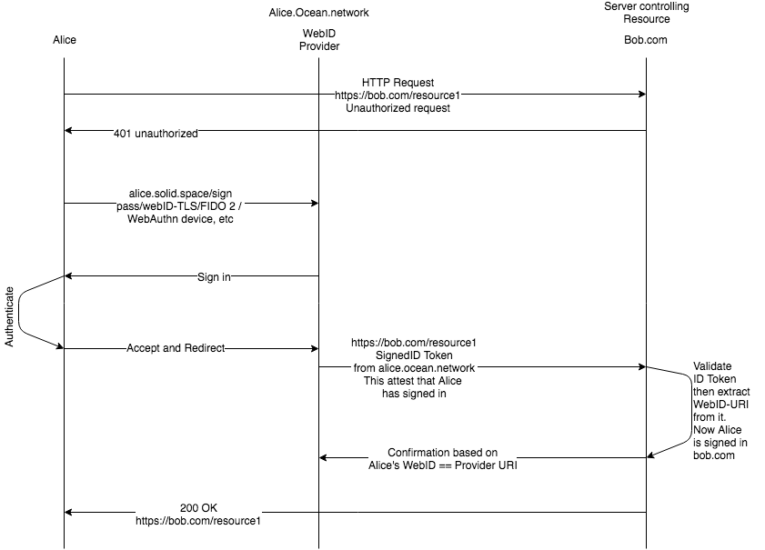
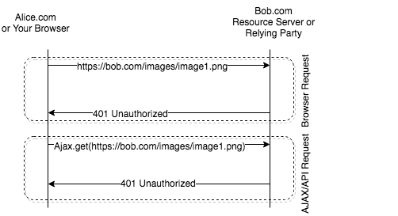
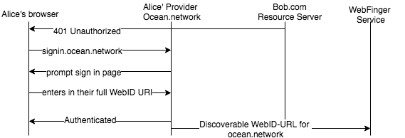
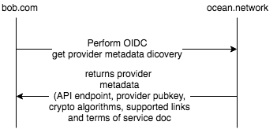
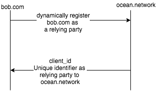
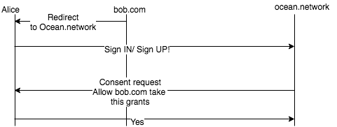
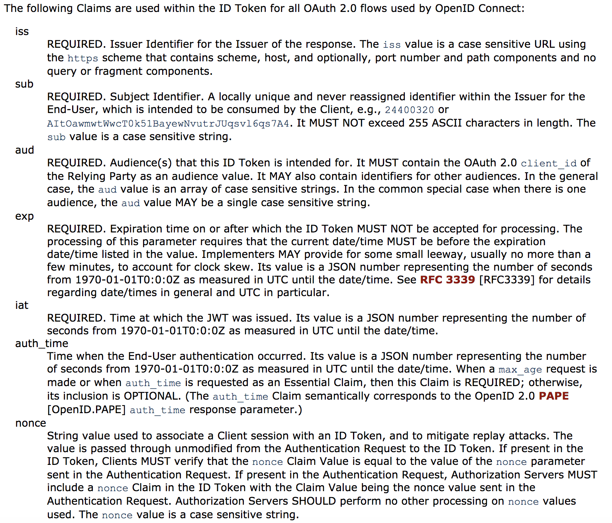
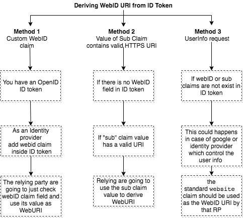

# Table of Content
 
   * [Jolocom IMS](#jolocom-ims)
   * [Blockstack IMS](#blockstack-ims)
   * [Permissioned Blocks](#permissioned-blocks)
   * [ConsenSys UPort](#consensys-uport)
   * [DID Project](#did-project)
   * [Kimono Secret Sharing](#kimono-secret-sharing)
   * [Secret Store Parity](#secret-store-parity)
   * [WebID OIDC](#webid-oidc)

## Jolocom IMS

## Blockstack IMS

## Permissioned Blocks

## Consensys UPort

## DID Project

## Kimono Secret Sharing

## Secret Store Parity

## WebID OIDC

It has basic 6 phases or steps. The following graph shows these phases. 

- **Phase 1:** 

**Initial Request** this could be direct browser request or AJAX/API client request. For instance, the browser 
request might return with <code>401 unauthroized code</code>, please enter your identifier (ie email) or WebURL. 

- **Phase 2:**

**Provider Selection and Discovery** this phase includes three sub steps as follows:

   1. Identity Provider selection
   
   So, Alice will select her provider (ie ocean.network) during the identity provider selection step. If she isn't signed in to 
   her authentication provider where Alice gonna enters her WebIDURI, and email. This identity provider (ocean.network)request should
   be discoverable through [webFinger](https://webfinger.net/)  based protocol.
   
    
   
   2. Identity Provider discovery 
   
   The resource provider or relying party (RP) <code>ie. bob.com</code> uses the webFinger protocol (simple discovery for the web such as 
   [webFist](https://github.com/bradfitz/webfist)) in order to performs OIDC provider metadata discovery.
   
   
   
   Check out these links [provider metadata](https://openid.net/specs/openid-connect-discovery-1_0.html#ProviderMetadata)
    and [openID provider configuration information](https://openid.net/specs/openid-connect-discovery-1_0.html#ProviderConfig).
  
   3. Dynamic client Registration (First time only)
   
   For first interaction between relying party (RP) <code>bob.com</code> and identity provider <code>ocean.network</code>. 
   The RP must perform Dynamic Client Registration. This happens in the back channel (no user involved in this step) and should 
   perform the [Dynamic client registration](https://openid.net/specs/openid-connect-registration-1_0.html) as shown below:
   
   

- **Phase 3:**

**Local Authentication to Provider**, once identity provider <code>ocean.network</code> is discovered by Relying Party <code>bob.com</code>. 
The relying party will direct <code>Alice</code> to sign in through identity provider. If the user did not have account, she can sign up automatically 
using the same page. 

Example for local authentication mechanisms

- WebID-TLS browser-side certificates 
- Username and password
- Hardware-based FIDO 2/ WebAuthentication devices 
- Federated sign-in with the likes of Github/Facebook/Google

- **Phase 4:**

**Authentication Response** once the user has signed in, the identity provider verify this identity by providing a proof 
of the initiated authentication then redirect the user to pre-registered <code>redirect_uri</code> (this already provided by 
relying party in provider discovery and dynamic registration phase). 

- **Phase 5:**

**Deriving a WebID URI** As a result of the last communication between the identity provider and relying party. Now the user account <code>Alice</code> 
was binding with <code>ID token</code> that contains different thing and one of these stuff is WebID. This should be signed by Alice's public key. The contents of 
the ID Token's webid claim is Alice's WebID URI, <code>https://alice.com/#i</code> 

But how we can derive <code>WebID URI</code> from <code>ID Token</code>. Well, 
as shown below, we can see that we have three methods for deriving the webId uri from ID token. But first have a look at this 
the following figure

Source: [openid connect core 1.0](https://openid.net/specs/openid-connect-core-1_0.html#IDToken)

Second, in order to derive it as relying party, you have three options as follows:

- **Phase 6:**

**WebID Provider Confirmation**

Why OIDC protocol needs a confirmation because we can have the following scenario. As mentioned in
OIDC specs that ID token's <code>sub</code>ject claim should be a unique for each user but if 
you are a bad actor, using a compromised identity provider server, you easily can claim the same WebID as 
shown below:

The confirmation process as follows:

* So as a relying party (RP) we should find a way to verify the claim. So the 
[origin](https://developer.mozilla.org/en-US/docs/Web/API/URL/origin) of ID token's issuer (ie issuer: https://example.com)<code>==</code> the 
 origin of WebID URI (ie. https://example.com/profile#me ) or origin of (WebID URI: https://alice.example.com/profile#me) == (issuer: https://example.com)
 
* Perform Authorized OIDC Issuer Discovery which could be conducted using one these options
    - issuer discovery from link header
    * issuer discovery from [WebID profile](https://www.w3.org/2005/Incubator/webid/spec/identity/#publishing-the-webid-profile-document)
* If the resource server unable to discover the provider URI, so it is going to reject the access. 

## Glossary

| keyword               | Description                                                         |
| ----------------------|-------------------------------------------------------------------------------------------------|
| User                  | Human user and this includes anyone who has webID profile and the same thing for resource owner.|
| User-Agent            | formal name for browser |
| POD | A Personal Online Datastore which could act as a host for user's webID profile and also it could act as relying party a recipient of those users' ID Tokens |
| Identity Provider (OP)| An OpenID Connect Identity Provider or<code> OP in OIDC specs</code>. sometimes it is called <code>Issuer</code> or POD which in case of google. |
| Resource Server (RS)  | The place where resources is stored or hosted or where the user wants to access. Sometimes identity provider and resource provider are the same such as Facebook. |
| Home POD vs Other POD | A user's Home POD is one that hosts their WebID Profile, and also acts as that user's Identity Provider. We use the term Other POD in this spec to denote some other WebID-OIDC compliant POD, acting as a Resource Server and Relying Party, that a user is trying to access using the WebID URI and Profile of their Home POD. When Alice tries to access a resource on Bob's POD, alice.com is her Home POD, and bob.com plays the role of the Other POD.|
| Public Client vs Confidential Client | Public - in-browser, mobile or desktop app, cannot be trusted with securely storing secrets (private key material, secret client IDs, etc). Confidential - server-side app, can be trusted with secrets. | 
| Presenter | A public client app that is trying to present a user's credentials from their home POD to some other POD. For example, Bob is trying to access, via a client app, a shared file on Alice's alice.com POD, logging in using his own bob.com POD/provider. In this example, bob.com is a Provider, alice.com is a Relying Party, and the client app (say, a browser-based HTML editor) is a Presenter. | 

