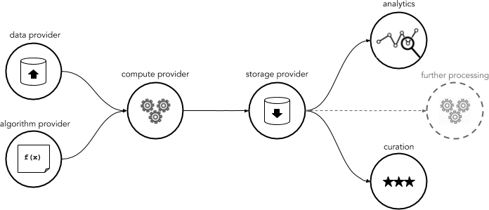
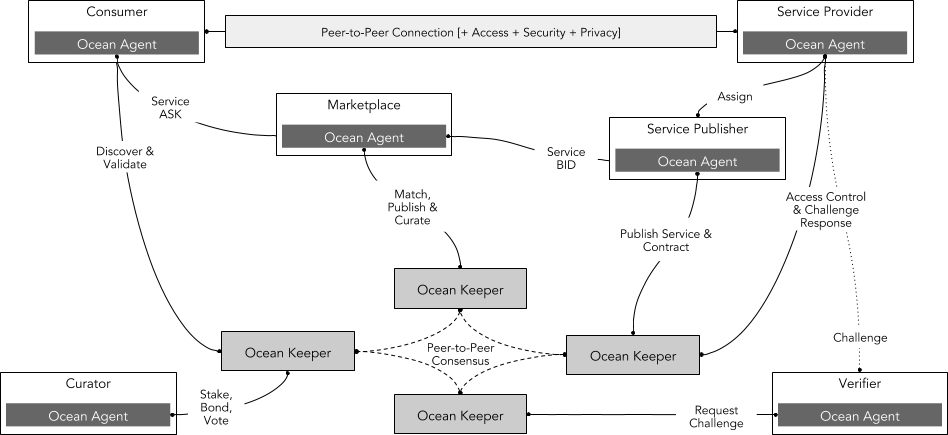

```
shortname: 3/ARCH
name: Ocean Protocol Network Architecture
type: Standard
status: Raw
editor: Dimitri De Jonghe <dimi@oceanprotocol.com>
contributors: Aitor Argomaniz <aitor@oceanprotocol.com>
```

Table of Contents
=================

  * [Table of Contents](#table-of-contents)
  * [Ocean Protocol Network Architecture](#ocean-protocol-network-architecture)
     * [Change Process](#change-process)
     * [Language](#language)
     * [Motivation](#motivation)
     * [Design Requirements](#design-requirements)
     * [Ocean Protocol Network Model](#ocean-protocol-network-model)
        * [At a glance](#at-a-glance)
        * [Agents and Keepers](#agents-and-keepers)
        * [Communication Protocols](#communication-protocols)
     * [Components](#components)
        * [Ocean Agent](#ocean-agent)
        * [Ocean Keepers](#ocean-keepers)
        * [Ocean DB](#ocean-db)
        * [Ocean Worker](#ocean-worker)
        * [Router](#router)
           * [Resolver](#resolver)
           * [Gossip](#gossip)
        * [Components Interaction](#components-interaction)
`

# Ocean Protocol Network Architecture

This document gives an overview of the Ocean Network Architecture. 
It specifies what components can be found in the network and how they interact with each other.

This specification is based on [Ocean Protocol technical whitepaper](https://github.com/oceanprotocol/whitepaper).

This specification is called **ARCH** henceforth.

## Change Process
This document is governed by the [2/COSS](../2/README.md) (COSS).

## Language
The key words "MUST", "MUST NOT", "REQUIRED", "SHALL", "SHALL NOT", "SHOULD", "SHOULD NOT", "RECOMMENDED", "NOT RECOMMENDED", "MAY", and "OPTIONAL" in this document are to be interpreted as described in [BCP 14](https://tools.ietf.org/html/bcp14) \[[RFC2119](https://tools.ietf.org/html/rfc2119)\] \[[RFC8174](https://tools.ietf.org/html/rfc8174)\] when, and only when, they appear in all capitals, as shown here.

## Motivation

Ocean Protocol connects data service PROVIDERS with CONSUMERS using 
contractual agreements to ensure attribution, payments, audit trails and privacy.
Data service providers are seen in the broad sense of a data intelligence ecosystem:
data, scripts, algorithms, storage, computation, scheduling, privacy and more. 

The ARCH covers a conceptual framework for provisioning contractual CONNECTIONS,
an overview of the network architecture and it's building blocks,
as well as a suite of protocols that implements the design. 

This ARCH is inspired by 
the [web3.js](https://github.com/ethereum/web3.js/) implementation, 
the Internet architecture described in 
[RFC 1122](https://tools.ietf.org/html/rfc1122), 
[RFC 1123](https://tools.ietf.org/html/rfc1123) and 
[RFC 1009](https://tools.ietf.org/html/rfc1009) and the 
[Interledger Protocol (ILP)](https://github.com/interledger/rfcs/blob/master/0001-interledger-architecture/0001-interledger-architecture.md#interledger-architecture).

This document MUST provide a common framework used describing the network together with the relevant components, protocols and interactions. 
All the different components described SHOULD be used as building blocks, allowing to compose the different scenarios using them.

## Design Requirements

The following design requirements guide the development of the Ocean Protocol:

* MUST use an open protocol, accessible to clients using any technology stack
* MUST be decentralized in ownership of vision, mission, governance, implementation and usage
* MUST support arbitrary levels of privacy comfort and regulation (anonymity, data escapes, right to be forgotten, zero-knowledge, etc)
* MUST be designed around self-sovereignty in terms of ownership, control and exposure of identities and data services. 
* MUST respect rights of owners and creators.
* MUST support data services of all types, including:
  - Data assets
  - Data operations including:
    - Data transformation operations
    - Machine learning operations
    - Data interaction and visualisation libraries
* MUST support off-chain operations for storage and compute
* MUST enable interoperability (i.e. sharing of data assets and services) between multiple marketplace implementations 
and multiple decentralized and centralized technology stacks 
* MUST store a record of all asset provenance
* MUST allow metadata governance (as defined by domain specific use cases)
* MUST allow custom control logic for assets and interactions
* SHOULD incentivize the network towards ecosystem objectives and the commons


Decentralization impacts the network design in the following ways:

- there are no centralized components at the protocol level
- nodes in the network are assumed to be Byzantine and Sybil actors
- events and messages in the network are recorded as signed transactions
- the full history of transactions is stored as a cryptographically linked data structure
- business logic that triggers state transitions 

## Ocean Protocol Network Model

### At a glance

Ocean protocol is a decentralized network for data service supply chains.
Such a network allows to connect to, monetize on and curate arbitrary data services.



Service contracts provide an interface between a service PROVIDER and CONSUMER.
A basic contract would allow a CONSUMER to pay (or simply ask) for a (free) service and hence gain access to that service.
Upon a service request, a proof of service is delivered together with a service response. 


In practice, the service contracts are smart contracts that run on a decentralized infrastructure.
We'll refer to the network operators as KEEPERS.
The client software that interacts with the smart contracts and services are called AGENTS.

Note that in many cases data services from other (de)centralized networks will be part of a service supply chain.
Such networks operate with their native tokens and service proofs (Filecoin/Proof-of-SpaceTime, Truebit/Verifiers, 
Enigma/Private contracts, ...). 
In Ocean protocol, BRIDGE nodes allow for inter-blockchain communication (IBC).
Their responsibility is to connect different networks with Ocean network in order to provide a single interface for 
service contracts, provide token exchange and resolve proofs from other networks.

 

### Agents and Keepers

At the core of the network are nodes that can be either AGENTS and KEEPERS.
Each node in the network can be regarded as an AGENT with certain behavior.

AGENTS run software that is responsible for:
- exposing internal attributes and services of the AGENT
- setting up connections between services
- interact with KEEPERS by means of transactions and smart contracts 

Depending on the service provided to the network, different types of behavior 
can be observed in the network such as CONSUMERS, PROVIDERS, MARKETPLACES, PUBLISHERS, CURATORS and VERIFIERS.

KEEPERS are nodes that form the Ocean consensus network (also known as miners or validators in other projects). 
These nodes have replicated behavior that is coordinated by a consensus protocol.
Practically, KEEPERS run software that is responsible for validating transactions, smart contracts execution and shared state storage.

A CONTRACT is the interface between AGENTS and is enforced and validated at the KEEPER level.

A BRIDGE is an AGENT that connects the state between Ocean KEEPERS and other consensus networks.

Below is a diagram that depicts various AGENT roles as well as some example interactions.



One of the main responsibilities of a CONTRACT between AGENTS is to lock up funds 
and have means to resolve the transfer of funds (for example by verification of CONNECTION-related cryptographic proofs). 
The contract is generic and sent as a payload of a transaction (TX) to the consensus engine.

The interaction between the consensus layer and the AGENTS is driven by transactions:

* As a means of token transfer
* For deploying contracts and registering metadata
* For calling contracts with specific input variables and hence updating the contract state.

It's the responsibility of the AGENTS to construct valid transactions and contracts. 
Otherwise they won't be accepted by the consensus layer.

We foresee a few ways to set up contracts:

* Facilitation by a marketplace
* Peer-to-peer between AGENTS
* Open ended on-chain. ie send a valid TX to the contract address and gain service access

It should be noted that a minimum viable Ocean network only requires KEEPERS, CONSUMERS and combined PUBLISHER-PROVIDERS.

### Communication Protocols

Ocean Network foresees 3 types of communication channels:

1. AGENT-AGENT communication

At this layer we have for example the service connections between service provider and consumer. 
Potentially, these channels allow full duplex communication.
The access and privacy of the channel is coordinated by the contract layers below.


2. AGENT-KEEPER communication

AGENTS communicate on-chain by means of signed transactions and event listeners or event polling.
KEEPERS subscribe to these transactions and either validate them and store them in a pool of unconfirmed transactions (MEMPOOL)

3. KEEPER-KEEPER communication

KEEPERS within a decentralized network achieve consensus about a shared state like a Directed Acyclic Graph (DAG).
The consensus algorithms may need to coordinate between faulty, Byzantine and Sybil actors. 


Below, you can find a representation of the network with an emphasis to communication channels.
The image depicts a PUB/SUB method of communication as an example


## Components

At the most simplistic level, the Ocean architecture can be broken down into 3 core components: the keeper/contracts, the agent, and the front-end. Operating between these components are requests that faciltate syncronized operations, and events that can take place asynchronously.


The Ocean ARCH is composed of independent components:


### Ocean Agent

An abstraction layer in charge of exposing a common and stable API to the network consumers. 

The client outputs transactions that are send to the keeper. 
Provides a service integrity layer to cryptographically secure bindings with off-chain services, 
as well as privacy & multicast capabilities. 
This layer abstracts the service contracts at the client side and ensures two-way binding with the KEEPERS

An detailed overview of the Ocean AGENT can be found in  [OEP-4/AGENT](../4/README.md) 

### Ocean Keepers

Implements the Ocean Virtual Machine and all the business logic embedded in validation and smart contracts:

* Interacts with the AGENTS through transactions. 
* Executes the Smart Contracts. The VM serves as a deterministic state transition mechanism.
* Stores transactions, blocks and contract state - such as bytecode, proofs, variables - in a Directed Acyclic Graph (DAG). 
* Is a validation engine for transaction and contract logic.
* MUST be [power-fault tolerant](https://filecoin.io/power-fault-tolerance.pdf) (PFT) 

Throttling and spam prevention is done at the VM validation level. 
TX's have fees attached, could have some Client-side PoW and invalid tx's won't get replicated by honest nodes.

### Ocean DB

A database with the following capabilities:

* Interacts with the AGENTS through API calls and resolvers. 
* Stores metadata about assets and actors in a database. 
* Has a query layer and an indexing scheme.
* Is OPTIONAL and enhances discovery functions in marketplaces
* OPTIONAL Byzantine fault tolerant (BFT).

An detailed overview of the Ocean DB can be found in  [#TODO:OEP-OCEANDB](../<OCEANDB>/README.md)


### Ocean Worker

A work-dispatch engine with the following capabilities:

* Interacts with the AGENTS through transactions.
* Performs compute intensive jobs such as mining and proofs validation
* Can challenge AGENTS to provide succinct proofs
* OPTIONAL fault tolerant (FT)

An detailed overview of the Ocean Worker can be found in  [#TODO:OEP-OCEANWORKER](../<OCEANWORKER>/README.md)

### Router

As the metadata of assets and actors is not stored on-chain, but rather in Ocean DB, this means only cryptographic 
identifiers are available on-chain. In order to enhance discovery and usability of the system, one would want to resolve 
those identifiers.

#### Resolver

The resolver takes a cryptographic identifier (like a DID) and resolves it into a related data object.
This object could embed metadata information about the resource as well as related service endpoints.

The task of the resolver is to facilitate the mapping between the identifier and the data object. 

#### Gossip

Ocean DB and related services do not have a centralized index such as DNS or Google.
This means that resource information is scattered amongst multiple actors in the system.
The gossip protocol allows to communicate the location of resource indices and their mapping

An detailed overview of the router, resolver and gossip protocol can be found in  [#TODO:OEP-ROUTER](../<ROUTER>/README.md)

### Components Interaction

An Ocean Node can run all of those processes or any combination of them. 
It will allow to have specialized nodes, depending of the requirements of the users running those nodes.


In the above picture you can see multiple set up combinations of an Ocean Node. 
The first one (top left), shows an Ocean Node running an Agent and a Full Keeper (Decentralized VM, Database and Worker). 
Other scenarios could require specialized deployments to run Worker nodes, Agents, Database nodes, etc.

