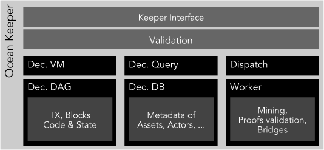
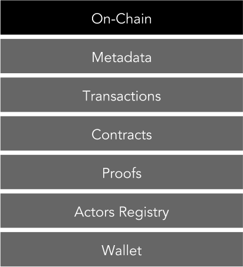
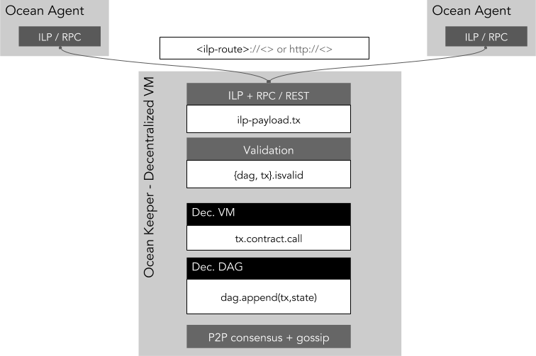
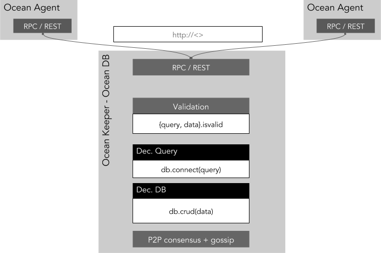

```
shortname: 4/KEEPER
name: Ocean Keeper
type: Standard
status: Raw
editor: Aitor Argomaniz <aitor@oceanprotocol.com>
contributors: Dimitri De Jonghe <dimi@oceanprotocol.com>
```

This document describes the Ocean Architecture. It focus in which are the main responsabilities, functions and components implementing the architecture.

This specification is based on [Ocean Protocol technical whitepaper](https://github.com/oceanprotocol/whitepaper).

The Ocean Protocol Archite specification is called **ARCH** henceforth.


## Change Process
This document is governed by the [2/COSS](../2/README.md) (COSS).

## Language
The key words "MUST", "MUST NOT", "REQUIRED", "SHALL", "SHALL NOT", "SHOULD", "SHOULD NOT", "RECOMMENDED", "NOT RECOMMENDED", "MAY", and "OPTIONAL" in this document are to be interpreted as described in [BCP 14](https://tools.ietf.org/html/bcp14) \[[RFC2119](https://tools.ietf.org/html/rfc2119)\] \[[RFC8174](https://tools.ietf.org/html/rfc8174)\] when, and only when, they appear in all capitals, as shown here.

## Goals
The primary goal of KEEPER is to detail the internal architecture and interfaces exposed by the Keeper node, and the elements composing the Ocean Keeper functionalities. 
It MUST to provide a common framework used describing the technical solution to put in place. 

All the different components described, SHOULD be used as building blocks, allowing to compose the different scenarios using those.

## High Level Architecture
This document use as reference and starting point the Architecture defined by the [3/ARCH](../3/README.md) (ARCH).


# Keeper Architecture

## Responsibilities



The main responsibilities of the Keeper are:

* Expose an interface to receive requests requiring to execute some actions. Initially this will expose a HTTP RPC interface
* Validate the input requests implementing the RBAC system 
* Persist the Metadata and Transactions information On-Chain
* Maintain the decentralized state including the Proofs of Service, Contracts bytecode and Actors registry
* Implement the Curation Market Business logic for data and services
* Manage and track the IP ownership of assets and services during their creation and access
* Provide the Token curated registry of actors
* Maintain the P2P consensus between the Keeper nodes
* Orchestrate the Keeper business logic interacting with the different external resources
* Manage the external Processing entities providing computing capabilities
* Manage the external Storage entities providing storage capabilities

## Decentralized State




**Ocean Core** itself does not store the content of the Assets, instead, it links to data that is stored, and provides mechanisms for access control. At the same time Keepers store a different kind of metadata:

* **Assets and Services Metadata** - Information describing the Assets or Service including the owner, attributes, pricing model and so on.
* **Transactions** - Confirmed transactions between actors. It doesn’t include the negotiation messages.
* **Contracts** - Information about the contract and the contract definition itself.
* **Proofs** -Information about the validation proofs and the proof definition itself. 
* **Actors Registry** - As soon as an actor is allowed into the system, the metadata describing what that actor is and does is appended to the Actor Registry.
* **Wallet** - Persist the account tokens balance.

## Keeper Components

As was described before, the Keeper full node it's implemented by three main building blocks:

* Decentralized VM 
* Ocean DB
* Ocean Worker

### Decentralized VM

The Decentralized VM is a blockchain-based distributed computing platform and operating system featuring smart contract (scripting) functionality.


The internal state is based in a **DAG** structure. DAG is a Direct Acyclic Graph data structure that uses a topological ordering. The sequence can only go from earlier to later. DAG is often applied to problems related to data processing, scheduling, finding the best route in navigation, and data compression.


The payload associated to each transaction includes all the data necessary to execute the Smart Contracts in a deterministic way. In our case, a part of the binary content of the contracts, it includes an internal state with information about:

* Curation Market
* Pricing
* Actors Registry
* Proofs

The Decentralized VM will expose the main capabilities through the Smart Contract external interfaces. It will allow the integration between this part of the Keeper node and the rest of the network.



Main logic components implemented in the Decentralized VM are:

#### Curation Market

Implementing:
* The Token Curation Market (TCM) Business logic for data and services
* The Token curated registry of actors

#### RBAC system

In charge of validating the incoming requests, checking if the actions requested can be performed depending of the user privileges/roles. To do that, the component integrate the Actors registry on-chain information.

#### Pricing module 

It should implement a flexible pricing model allowing different scenarios:
* Free pricing
* Fixed price
* Smart Contracts - It would support more flexible pricing models (pricing defined from the marketplace side, auctions, etc.)

#### Proofs of Service

It manages the storage and validation of the different kind of Proofs of Services. It integrates with the Data & Services interfaces allowing to retrieve the proofs of services provided by third-parties.


### Ocean DB

Ocean DB is a decentralized BFT database, allowing to store different kind of information in an efficient way. Including:

* Assets and Service metadata
* IP rights
* Contract details
* Transactions information
* ...



Ocean DB will be based in an existing technology (ie. BigChainDB), and will be able to running in a totally independent way of the rest of the Keeper components.

Ocean DB will expose the API's (RESTful) allowing the integration in an easy way.

### Ocean Worker

A head-less component (without external interface) in charge of perform most of the compute intensive tasks, like mining and proofs validation. 
Business logic related with **Verifiers** and **Curators** is performed in the Worker scope.

The work interact with the rest of the world through the system transactions, so will be listening those in order to perform different actions. It includes:  

* Validate Proofs of Service
* Challenge to Providers in order they provide some Proofs
* Provide Assets and service curation

## Keeper Functions and Component responsibilities

Most important functions or actions provided by the keeper are:
* Assets management - Allowing to register the assets metadata associated to the publisher and provider of the asset. The complete metadata information will be stored in the Ocean DB, including IP. References to the Asset, owner and pricing will be stored in the decentralized VM. Main capabilities provided are:
  - Asset registering - Allowing to register the metadata of new Assets on-chain. Should register the IP rights of the owner.
  - Updating and disabling an Asset - Allowing to update the metadata of an Asset or disable it. Only metadata can be updated, if the Asset content has to be modified, it must be handled as a totally new Asset (probably as a derivation of the previous one). This function must validate that only the owner can update or delete the asset.
  - Retrieve Asset information - Useful to obtain the metadata information of an Asset.
  - Add a Provider to an Asset - Associating one specific asset with one provider. It will include the pricing and proof information associated with the provider.

* Actors management - Allowing to register the actors basic information. Basic registry of actors will be stored in Ocean DB. It includes:
  - Actor registering - Allowing to register a new Actor on-chain
  - Updating and disabling Actors - Allowing to update the metadata of an Actor or disable it. This function must validate that only the own Actor can modify his/her information.
  - Retrieve Actor information - Useful to obtain the metadata information of an Actor.

* Curation Market - Allowing to provide curation information about Assets, Services and Actors of the system. Curation information should be managed using the Decentralized VM and Ocean DB. The Curator put tokens on stake of this curation. The functions provide include:
  - Curate an Asset - Allowing to curate an Asset
  - Curate an Actor - Allowing to curate an Actor
  - Curate a Service - Allowing to curate an Asset

* Market Transactions - Allowing to define the contract between parties. This information should be managed using the Decentralized VM and Ocean DB. Should provide the following functions:
  - Contract definition- After negotiate the contract terms (off-chain), it’s necessary to store (on-chain) the terms of the contract
  - Contract agreement - All the parties involved in a contract (publisher, provider, consumer, marketplace) agree the terms of a contract.
  - Access - After of having the contract in place, the Consumer can request to get Access to the Asset or Service. If the requirements are met (correct contract), the access request is registered (on-chain) and the Provider is notified to give access to the Asset or Service defined in the contract.
  - Access authorization - The Provider authorizes the consumption of the Asset or Service defined in the contract. It provides the information necessary to consume the element. Should register the IP grants related with the Asset or Service and the Consumer.
  - Contract settlement - Once enough proofs are provided (see verification actions), the contract goes into settlement. Keepers, Providers, Marketplaces or Verifiers can request to put a contract on settlement after to have all the Proofs of Service required to validate that service has been provided.

* Verification - Allowing to handle the actors and assets verification and whitelisting process.  This information should be managed using the Decentralized VM and Ocean DB. Should provide the following functions:
  - Definition of Verification challenge - A pre-appointed verifier and/or the client challenges the service to provide proofs that the requested service is delivered according to integrity specifications.
  - Provide a Verification Proof - The service accepts the challenge, computes the proof and stores this on-chain with a reference to the contract.
  - Get details of a Verification Proof - Retrieval of Verification Proof information.
  - Actor Whitelisting - A verifier send a whitelisting request approving or denying to an actor
  
* Wallet - Allowing the manage the basics about the user wallets.  This information should be managed using the Decentralized VM. Should provide the following functions:
  - Wallet creation - Creation of a wallet
  - Obtain wallet information - Providing information about the wallet address owner and balance
  - Transfer of funds - Transfer of funds between wallets


